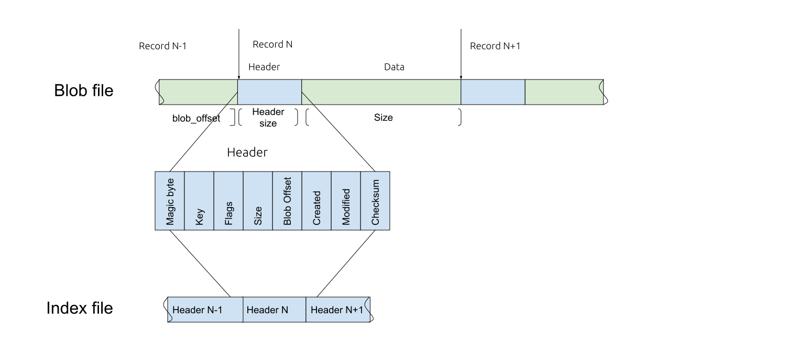

Pearl
=====
[](https://github.com/qoollo/pearl/actions/workflows/build.yml)
[](https://github.com/qoollo/pearl/actions/workflows/tests.yml)
[](https://crates.io/crates/pearl)
[](https://docs.rs/crate/pearl)


Append only key-value blob storage on disk

* [documentation](https://qoollo.github.io/pearl/pearl/index.html)

Table of Contents
=================

* [Overview](#overview)
    * [Storage scheme](#storage-scheme)
    * [Blob](#blob)
        * [Header](#header)
    * [Record](#record)
        * [Header](#header)
    * [Index](#index)
        * [Header](#header)
* [Rust Version](#rust-version)

# Overview
## Storage scheme


## Blob
### Header

Structure:
```rust
struct Header {
    magic_byte: u64,
    version: u32,
    flags: u64,
}
```
Description

| Field       | Size, B | Description |
| ----------- | :----:  | :----------- |
|magic_byte   | 8       | marks `pearl` blob
|version      | any     | used to check compatibility
|flags        | 1       | additional file props

## Record
### Header

Structure:
```rust
pub struct Header {
    magic_byte: u64,
    key: Vec<u8>,
    meta_size: u64,
    data_size: u64,
    flags: u8,
    blob_offset: u64,
    created: u64,
    data_checksum: u32,
    header_checksum: u32,
}
```
Description

| Field          | Size, B | Description |
| -------------- | :----:  | :----------- |
|magic_byte      | 8       | separates records in blob
|key             | (any)   | key for record location and searching
|meta_size       | 8       | meta length
|data_size       | 8       | data length (without header)
|flags           | 1       | additional record metadata
|blob_offset     | 8       | record offset from blob start
|created         | 8       | created timestamp
|data_checksum   | 4       | data crc32 checksum (without header)
|header_checksum | 4       | header crc32 checksum (only record header)

# Rust Version
`pearl` works on stable rust and above
```
$ rustup update
$ cargo build
```
